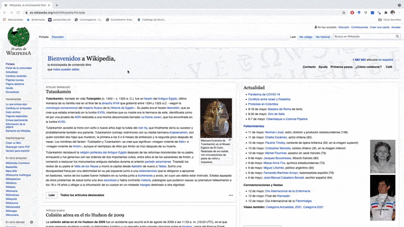
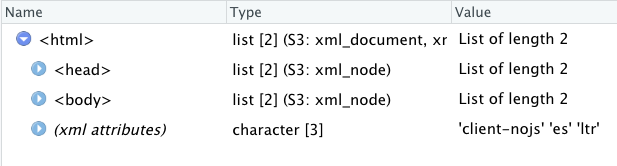
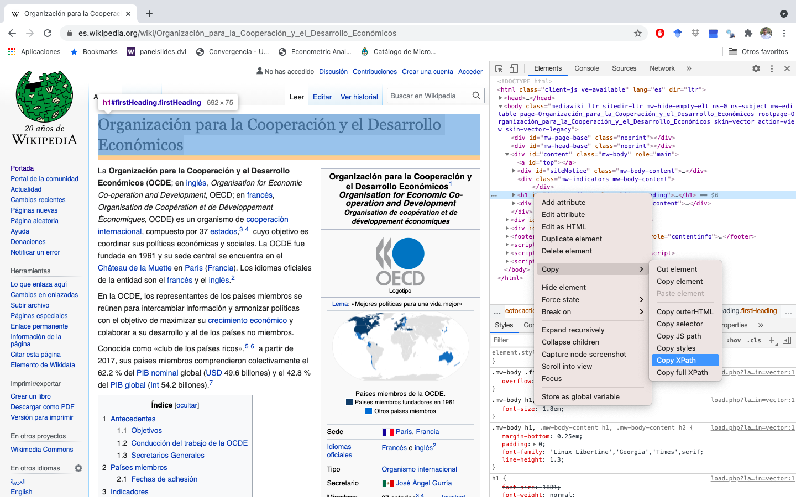

```{r setup, include=FALSE}
# load packages
library(pacman)
pacman::p_load(here,knitr,tidyverse,data.table,plyr,XML,rvest,xml2)

# option html
options(htmltools.preserve.raw = FALSE)
options(htmltools.dir.version = F)
opts_chunk$set(fig.align="center", fig.height=4 , dpi=300 , cache=F)
```

name: contenido
# Ya vimos..

- [Procesamiento de datos raster en R](https://github.com/taller-R/clase-13)

--

# Hoy veremos 

1. [Introducción a Web-scraping](#intro)
 
    * 1.1. ¿Qué es web-scraping?  
 
    * 1.2. ¿Qué es HTML?

2. [Aplicación en R](#example)

    * 2.1. Extraer atributos de un elemento
    
    * 2.2. Extraer tablas
    
<!----------------------------------->
<!--- Introducción a web-scraping --->
<!----------------------------------->
---
class: inverse, center, middle
name: intro
# [1. Introducción a Web-scraping](#contenido)

<html><div style='float:left'></div><hr color='#FF007F' size=1px width=796px></html>

---
# 1. ¿Qué es web-scraping?

Es una técnica usada para automatizar los procesos de extracción de información de sitios web, como tablas, textos o link a otras páginas.

# 1.2. ¿Por qué hacer web-scraping?

* Funciona mejor que copiar y pegar la información de la web
* Es rápido y replicable
* Se puede generalizar el proceso en la mayoría de los casos 

# 1.3. Antes de hacer web-scraping...

* Leer los términos y condiciones de la pagina web

---
# 1.4. ¿Qué es un HTML (Hyper Text Markup Language)?


* HTML o HyperText Markup Language no es un lenguaje de programación, HTML es un lenguaje de marcado de hipertexto.

* Se escribe en su totalidad con elementos, estos elementos están constituidos por etiquetas, contenido y atributos (mas adelante veremos que son). 

* Este lenguaje que es interpretado por el navegador web para mostrar las paginas web tal y como estamos acostumbrados a verlas.

* Esta estructurado como un árbol para el cual se puede rastrear cualquier la ruta de cualquier nodo o etiqueta.

---
# 1.5. ¿Cómo se ve un HTML?

<div align="center">

</div>

---
# 1.6. Elementos de un HTML

Como dijimos anteriormente, HTML es un lenguaje formado por elementos, cada elemento esta conformado por la etiqueta, los atributos y el contenido. Así se ve un elemento:

`<p id="texto"> Hola mundo </p>`

Etiqueta: `<p>`
Atributos: `id="texto"`
Contenido: `Hola mundo`

# 1.7. Etiquetas 

Las etiquetas sirven para delimitar el inicio y el final de un elemento.

* Inicio de la etiqueta:   `< >`
* Fin de la etiqueta:   `<\ >`

---
# 1.7.1. Algunos ejemplos de etiquetas

* `<p>`: Párrafos
* `<head>`: Encabezado de la pagina
* `<body>`: Cuerpo de la pagina
* `<h1>, <h2>,...,<hi>`: Encabezados, Secciones
* `<a>`: links
* `<li>`: Ítem en una lista
* `<table>`: Tablas
* `<td>`: Una celda de datos en una tabla
* `<div>`: División. Sirve para crear secciones o agrupar contenidos.
* `<script>`: Se utiliza para insertar o hacer referencia a un script

# 1.8. Atributos del elemento

Los atributos proveen información adicional de un elemento y siempre se expresan en la etiqueta de inicio y se les asigna un nombre y un valor:

`<p id="texto">` Hola mundo `</p>`

Aquí el nombre del atributo es "id" y el valor es "texto". Nota: Un elemento puede tener varios atributos

---
# 1.9. Estructura de un HTML en una pagina web
```{r, eval=FALSE}
(1) ---->  <!DOCTYPE html> 
(2) ---->  <html>
(3) ---->  <head>
(4) ---->  <meta charset="utf-8">
(5) ---->  <title> Aquí va el título de la pagina</title>
           </head>
(6) ---->  <body>
           <h1>Aquí va nuestro titulo y esta en la etiqueta <u>h1</u>.</h1>
           <h2>Este es un subtítulo y se encuentra en la etiqueta <u>h2</u>.</h2>
           <p> Este es un párrafo muy pequeño que se encuentra dentro de la etiqueta <b>p</b> de <i>html</i></p>
           </body>
           </html>
```
* `(1)` Tipo de documento (indica que estamos trabajando con html5)
* `(2)` Etiqueta de inicio
* `(3)` Etiqueta de Cabeza
* `(4)` Codificación
* `(5)` Titulo de la pagina web
* `(6)` Cuerpo (contenido de la pagina)

<!----------------------->
<!--- Aplicación en R --->
<!----------------------->
---
class: inverse, center, middle
name: example
# [2. Aplicación en R](#contenido)

<html><div style='float:left'></div><hr color='#FF007F' size=1px width=796px></html>

---
# 2.0. Antes de hacer web-scraping...

Antes de hacer web-scraping vamos a leer los términos y condiciones de la pagina web. Se puede hacer agregando la ruta **/robots.txt** al final de la URL.

<div align="center">

</div>

---
# 2.1. Extraer el HTML

Vamos a usar las librerias `XML`, `rvest` y `xml2` 

```{r,eval=T,echo=T,warning=T}
require(pacman)
p_load(tidyverse,XML,rvest,xml2)

# read_html() lee el HTML de la pagina y lo convierte en un objeto del tipo 'xml_document' y 'xml_node'
myurl = "https://es.wikipedia.org/wiki/Organización_para_la_Cooperación_y_el_Desarrollo_Económicos"
myhtml = read_html(myurl)
class(myhtml)
```
<div align="center">

</div>

---
# 2.2. Extraer elementos del HTML (usando xpath)

El lenguaje Xpath es el sistema que se utiliza para navegar y consultar los elementos y atributos contenidos en la estructura de un documento XML.

<div align="center">

</div>

---
# 2.3. XML Path Language (xpath)

Vamos a inspeccionar los elementos para obtener la ruta dentro del HTML

<div align="center">

</div>

---
# 2.4. Extraer un texto
```{r,eval=T,echo=T,warning=T}
# extraer el primer parrafo de la pagina
myhtml %>% html_nodes(xpath = '//*[@id="mw-content-text"]/div/p[1]')

myhtml %>% html_nodes(xpath = '//*[@id="mw-content-text"]/div/p[1]') %>% 
class()

texto = myhtml %>% html_nodes(xpath = '//*[@id="mw-content-text"]/div/p[1]') %>% 
html_text() # Convertir en texto
texto
```

---
# 2.5. Extraer atributos de los elemtnos
```{r,eval=T,echo=T,warning=T}
# usando el atributo del elemento
myhtml %>% html_nodes(css = ".toctext") %>% html_text() # Extraemos los subtítulos de la pagina

myhtml %>% html_nodes(".toctext") %>% html_text() # Si no le indicamos que es un css, R reconoce que es un css

myhtml %>% html_nodes(xpath = ".toctext") %>% html_text() # Pero si usamos el xpath comete un error
```

---
# 2.6. Extraer usando el nodo
```{r,eval=T,echo=T,warning=T}
# html_node() vs html_nodes()
myhtml %>% html_nodes("a") # html_nodes() retorna el tipo de objeto y los 874 link que hay en la pagina
myhtml %>% html_nodes("a") %>% length()

myhtml %>% html_node("a") # html_node() retorna el tipo de objeto y el primer link de la pagina
myhtml %>% html_node("a") %>% length()
```

---
# 2.7. Extraer las URL a otras paginas
```{r,eval=T,echo=T,warning=T}
### 1.4. Extraer los link de las referencias
link = myhtml %>% html_nodes(xpath = '//*[@id="mw-content-text"]/div[1]/div[10]') # extraer el xml_nodeset de la sección de referencias
link

link = html_nodes(link,"a") # Extraer elementos que contienen un link (los que tienen la etiqueta a)

link = html_attr(link,'href') %>% as.data.frame() %>% setNames("link") # Extraer solo el link (atributo ref del elemento)

link = link %>% dplyr::filter(substr(.$link,1,4)=="http") # Filtrar solo los enlaces
link
```

<!--------------------->
<!---    Hoy vimos  --->
<!--------------------->
---
class: inverse, center, middle
name: view

# [Hoy vimos...](#contenido1)
<html><div style='float:left'></div><hr color='#FF007F' size=1px width=796px></html>

---
#  Hoy vimos...

- ☑ [Introducción a Web-scraping](#intro)

- ☑  [Aplicación en R](#example)
